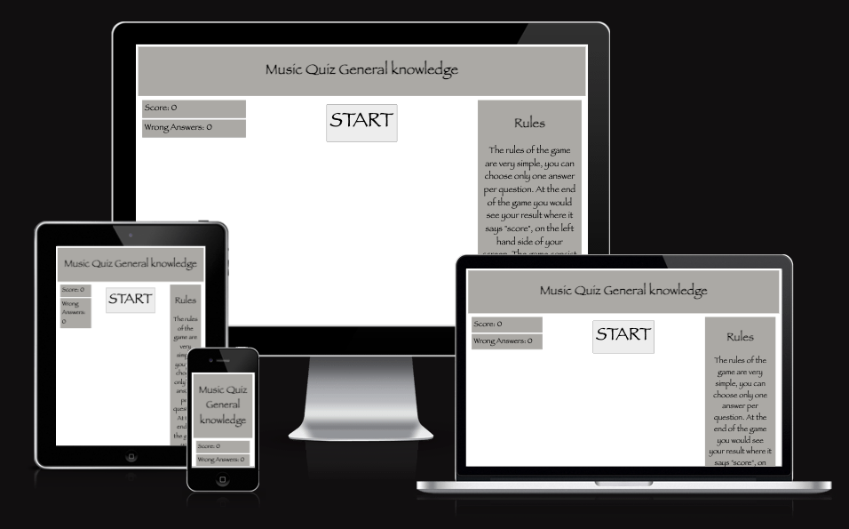
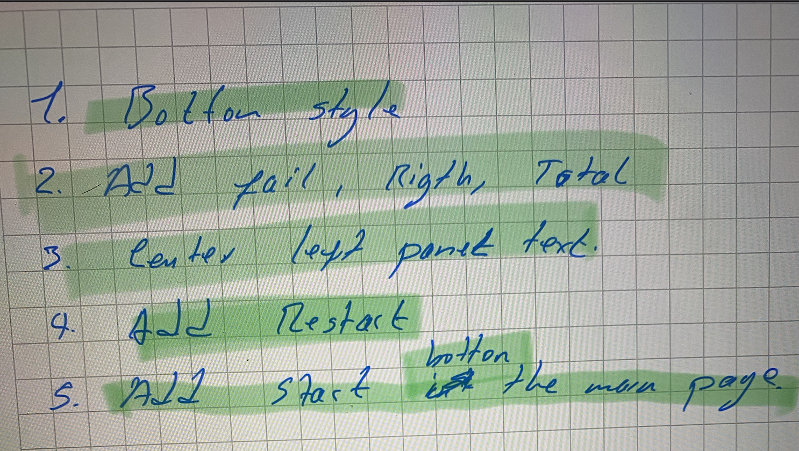
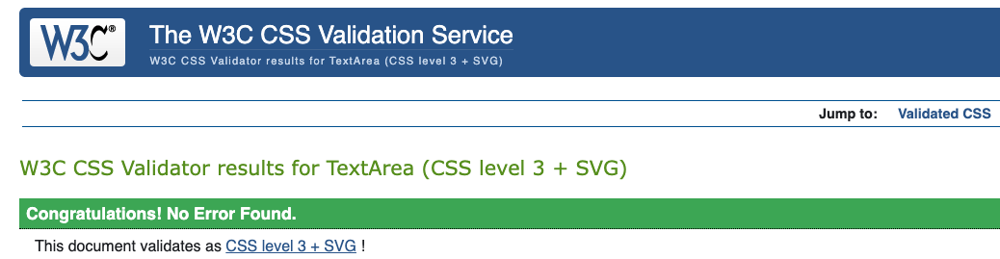
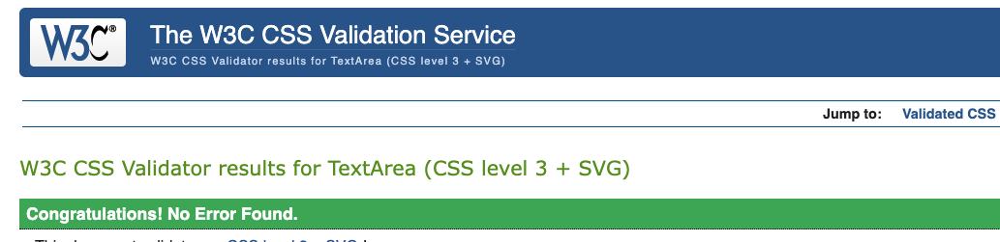
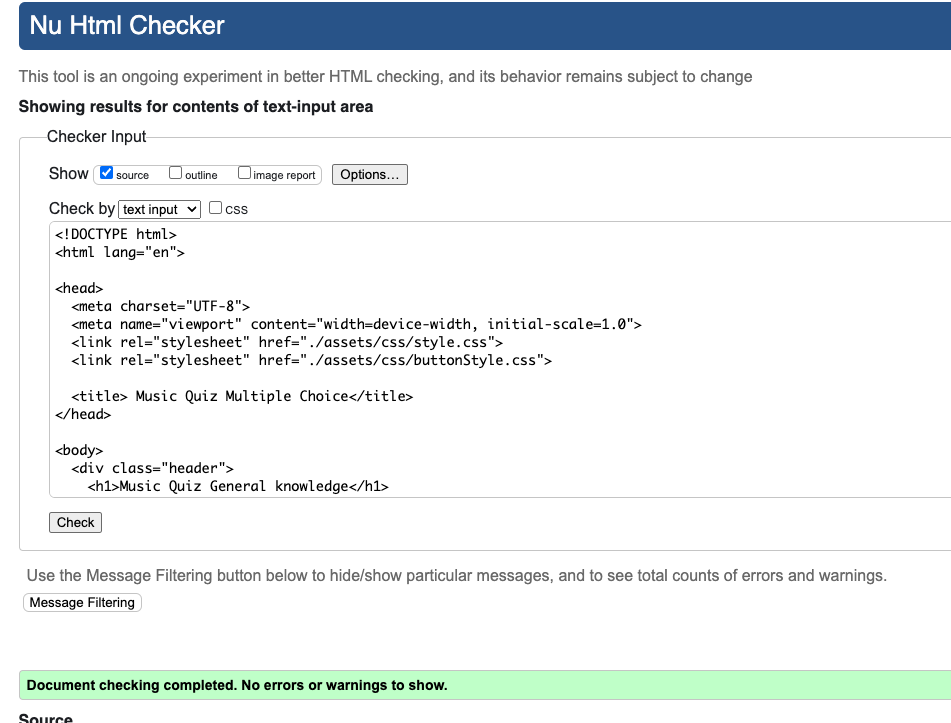
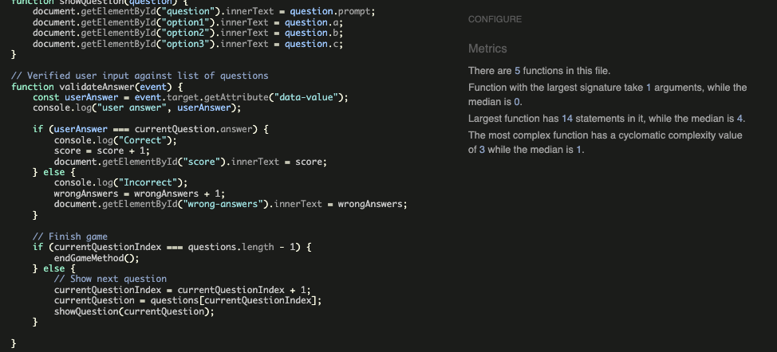
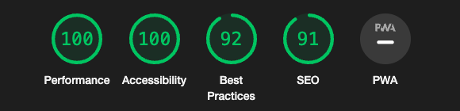
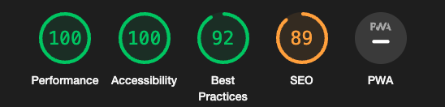

PORTFOLIO PROJECT - 2

MASTER QUIZ - MUSIC QUIZ GENERAL KNOWLEDGE

PURPOSE

Master Quiz game is created to entertain people of all ages with a very simple music quiz.

FINAL RESULT

THE MAIN IDEA

My initial idea for the project was to create music quiz game to entertain people of all range of ages. My target audience is anyone who is interested in general music knowledge and want to have some fun while learning about music facts. This can be any person of any age, gender and interest level.

The Features I wanted the project to have are:

To make the site easy to understand how teh game works. To keep it as simple as possible.

CONTENTS

UX/UI

This website was created to show my knowledge of HTML, CSS and JavaScript to provide users with visual and interaction content. The site should be easy and simple to navigate. The site should be easy to read and to understand the purposed of it.

Site Goals:

To put in practise that I understand the basic skills to used HTML, CSS and JavaScript. To give users an easy way to understand and easy way to navigate the website. To give users enough information to come back to the website for them to use it again and again. To make the site easily accessible from any device.

WIREFRAMES

FEATURES

The website consists of the following:

1 single page website with a header (title), the body consist of Score, Wrong Answers on the left hand side of the page and the Rules of the game on the right hand side of the page. Main content has 2 different colours (white and grey),text in black and footer on the bottom of the page with a "Thank you for playing this game" text.

TYPOGRAPHY

I chosen "fantasy", sans-serif as my Font-family.

TESTING

The site has been tested through different device sizes. Tested the website in different browsers.

DEVICES

I've tested responsiveness and functionality on the following devices and browsers: Android: Samsung Galaxy S8+ Samsung Galaxy S20 Ultra Galaxy Fold Samsung Galaxy A51/71 Apple: Ipad mini Ipad Air Iphone SE Iphone XR Iphone 12 PRO laptops: MacBook Pro 16" Browsers: Chrome Firefox Safari

VALIDATORS

CSS Validator checked and passed. HTML Validator checked and passed. JavaScript Validator checked and passed. See below for Validator results.

Lighthouse checked and passed. See below for results on Mobile and Desktop.

SOLVED BUGS AND ERRORS

Had some warning ES6 errors but all fixed.

UNSOLVED BUGS AND ERRORS

None

FUNCTIONALITY

All buttons have been hovered over and clicked on to ensure accessibility. Pages all load correctly on all device screen sizes. 

TECHNOLOGIES USED

HTML, CSS and JavaScript.

PROGRAMS USED

GIT For version control, commiting and pushing to github. GITPOD The IDE used to code this website. GITHUB Used to store repositories, files and images pushed from gitpod. AM I RESPONSIVE. Used to test responsiveness of the website at different screen sizes. CHROME DEVELOPER TOOLS For checking compatibilty, troubleshooting and editing code. 

CREDITS

Mike Dane Youtuber Software Developer. Kevin Powell Youtuber Software Developer (The king of CSS). FreeCodeCamp JS tutorials. Antonio Rodriguez my mentor. W3Schools YouTube Stackoverflow Student care, Tutors and the Slack community